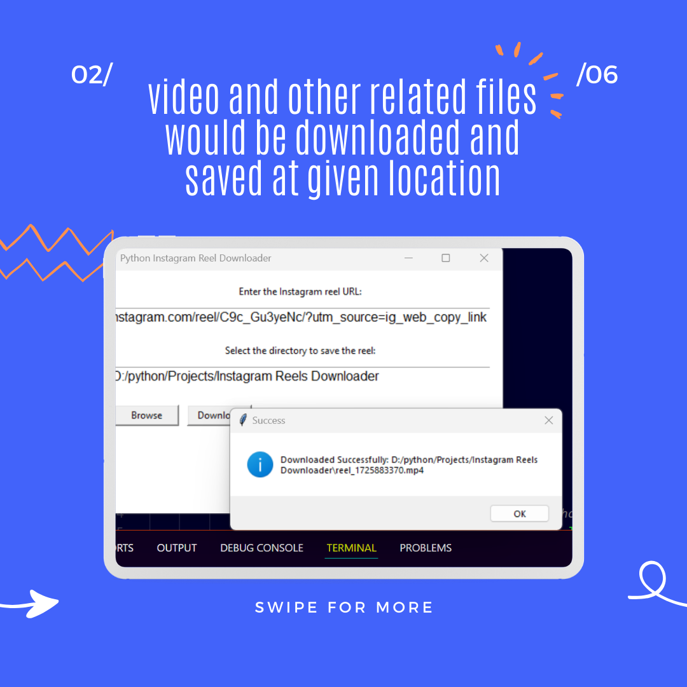
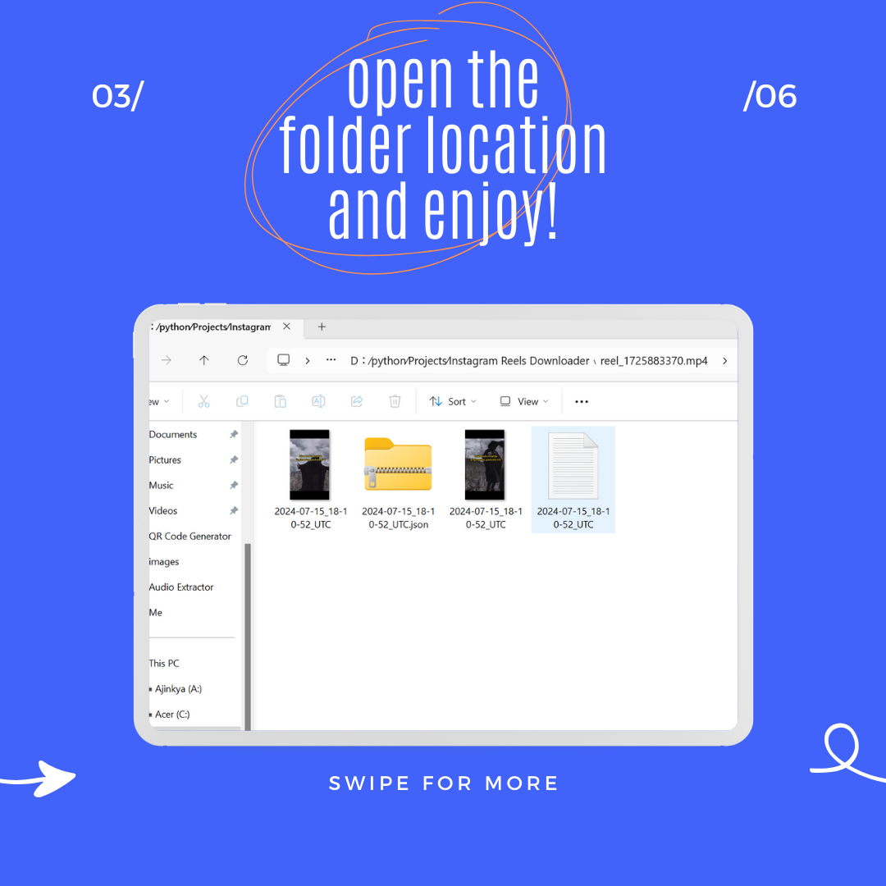

# Instagram Reel Downloader

 

 


Instagram Reel Downloader is a Python application that allows you to download Instagram Reels using their URLs. The application provides a graphical user interface (GUI) built with Tkinter and uses the Instaloader library to handle the downloading process.

## Features

- Download Instagram Reels by entering their URLs.
- Simple and user-friendly GUI built with Tkinter.
- Supports downloading multiple Reels at once.

## Requirements

- Python 3.x
- Tkinter
- Instaloader

## Installation

1. Clone this repository to your local machine:

    ```bash
    git clone https://github.com/AdityaManojShinde/Instagram-Reels-Downloader.git
    ```

2. Navigate to the project directory:

    ```bash
    cd instagram-reel-downloader
    ```

3. Install the required dependencies:

    ```bash
    pip install instaloader
    ```

## Usage

1. Run the application:

    ```bash
    python main.py
    ```

2. In the application window, enter the Instagram Reel URLs that you want to download, one URL per line.

3. Click the "Download Reels" button to start the download process.

4. Wait for the download to finish. Once the download is complete, a success message will be displayed.

## Contributing

If you find any bugs or issues with this tool, please feel free to open an issue in the GitHub repository. Pull requests are also welcome if you want to contribute to the code.

## License

This project is licensed under the MIT License. See the LICENSE file for more details.

## Author
Aditya Shinde